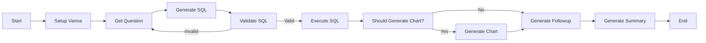
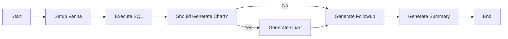

# LLM Middleware - PocketFlow Design Document

## 1. Requirements

The LLM Middleware is a web application that enables users to:
- Ask natural language questions about their data
- Get SQL queries generated from those questions
- Receive query results in table format
- Generate appropriate visualizations based on the data
- Get intelligent follow-up questions and natural language summaries

This application leverages PocketFlow's framework to create a modular, maintainable, and extensible system.

## 2. Flow Design

The application follows a natural language to SQL conversion workflow with the following flow:



We also have a simpler flow for directly executing existing SQL:



## 3. Utilities

The application uses the following utility functions:

1. **Vanna SDK Wrapper**
   - `name`: `call_vanna` (`utils/call_vanna.py`)
   - `input`: Various functions for different Vanna operations
   - `output`: Depends on the function (SQL, DataFrames, charts, etc.)
   - `necessity`: Core functionality for SQL generation and data processing

Functions include:
- `setup_vanna(config)`: Initialize the Vanna client
- `generate_questions(vn)`: Generate sample questions
- `generate_sql(vn, question)`: Convert question to SQL
- `is_sql_valid(vn, sql)`: Validate SQL syntax
- `run_sql(vn, sql)`: Execute SQL and return results
- `should_generate_chart(vn, df)`: Determine if chart should be generated
- `generate_plotly_code(vn, question, sql, df)`: Generate Plotly code
- `get_plotly_figure(vn, plotly_code, df)`: Create Plotly figure
- `generate_followup_questions(vn, question, sql, df)`: Generate follow-up questions
- `generate_summary(vn, question, df)`: Generate summary of results

## 4. Node Design

Our shared store design:
```python
shared = {
    "question": None,           # User's question
    "sql": None,                # Generated SQL
    "is_sql_valid": False,      # Flag for SQL validity
    "results": None,            # SQL query results (pandas DataFrame)
    "should_chart": False,      # Flag for chart generation
    "chart_code": None,         # Plotly chart code
    "chart": None,              # Plotly chart object
    "followup_questions": [],   # Follow-up questions
    "summary": None,            # Generated summary
    "config": {},               # Configuration (API keys, model settings, database paths)
    "vanna_client": None        # Vanna client instance
}
```

Node implementation:

1. **SetupNode**
   - `type`: Regular
   - `prep`: Read configuration from shared store
   - `exec`: Setup Vanna with the given configuration
   - `post`: Store Vanna client in shared store

2. **QuestionNode**
   - `type`: Regular
   - `prep`: None
   - `exec`: Get question from user input
   - `post`: Write question to shared store

3. **GenerateSQLNode**
   - `type`: Regular
   - `prep`: Read question and Vanna client from shared store
   - `exec`: Call Vanna to generate SQL
   - `post`: Write SQL to shared store

4. **ValidateSQLNode**
   - `type`: Regular
   - `prep`: Read SQL and Vanna client from shared store
   - `exec`: Validate SQL
   - `post`: Write validity flag to shared store, return "valid" or "invalid" for flow control

5. **ExecuteSQLNode**
   - `type`: Regular
   - `prep`: Read SQL and Vanna client from shared store
   - `exec`: Execute SQL query
   - `post`: Write query results to shared store

6. **ShouldGenerateChartNode**
   - `type`: Regular
   - `prep`: Read results and Vanna client from shared store
   - `exec`: Determine if chart should be generated
   - `post`: Write should_chart flag to shared store, return "chart" or "no_chart" for flow control

7. **GenerateChartNode**
   - `type`: Regular
   - `prep`: Read question, SQL, results, and Vanna client from shared store
   - `exec`: Generate Plotly chart code and create chart
   - `post`: Write chart_code and chart to shared store

8. **GenerateFollowupNode**
   - `type`: Regular
   - `prep`: Read question, SQL, results, and Vanna client from shared store
   - `exec`: Generate follow-up questions
   - `post`: Write followup_questions to shared store

9. **GenerateSummaryNode**
   - `type`: Regular
   - `prep`: Read question, results, and Vanna client from shared store
   - `exec`: Generate summary
   - `post`: Write summary to shared store

## 5. Implementation Details

The project is implemented with the following components:

1. **Core PocketFlow Implementation**
   - Located in `llmmiddleware/core/pocketflow.py`
   - 100-line implementation of the PocketFlow framework
   - Provides Node, Flow, Batch, and Async capabilities

2. **Node Implementations**
   - Located in `llmmiddleware/nodes/sql_nodes.py`
   - Implements all nodes described in the Node Design section

3. **Flow Implementations**
   - Located in `llmmiddleware/flows/sql_flows.py`
   - Creates three flows:
     - `create_sql_generation_flow()`: Main flow for natural language to SQL
     - `create_sql_execution_flow()`: Flow for executing existing SQL
     - `create_suggestion_flow()`: Flow for generating suggested questions

4. **Utility Functions**
   - Located in `llmmiddleware/utils/call_vanna.py`
   - Provides wrapper functions for Vanna API

5. **Web Interface**
   - Located in `app.py`
   - Streamlit web interface for interacting with the middleware

## 6. Optimization Features

The implementation includes several optimizations:

1. **Caching**
   - Caching SQL generation results to avoid regenerating for similar questions
   - Caching query results for frequently accessed data

2. **Efficient Error Handling**
   - Validation step before executing SQL to prevent errors
   - Graceful fallback when chart generation fails

3. **LLM Provider Flexibility**
   - Support for multiple LLM providers (OpenAI, Anthropic, Groq, etc.)
   - Easy switching between providers through configuration

## 7. Reliability Measures

To ensure reliability, the implementation includes:

1. **Input Validation**
   - Validating SQL syntax before execution
   - Checking data types and shapes for visualization

2. **Logging**
   - Detailed logging throughout the flow
   - Error messages and stack traces for debugging

3. **Testing**
   - Unit tests for utility functions
   - Integration tests for end-to-end workflows
   - Continuous testing in Docker environment

4. **Error Recovery**
   - Node retry logic for intermittent failures
   - Alternative flows when primary flow fails
 